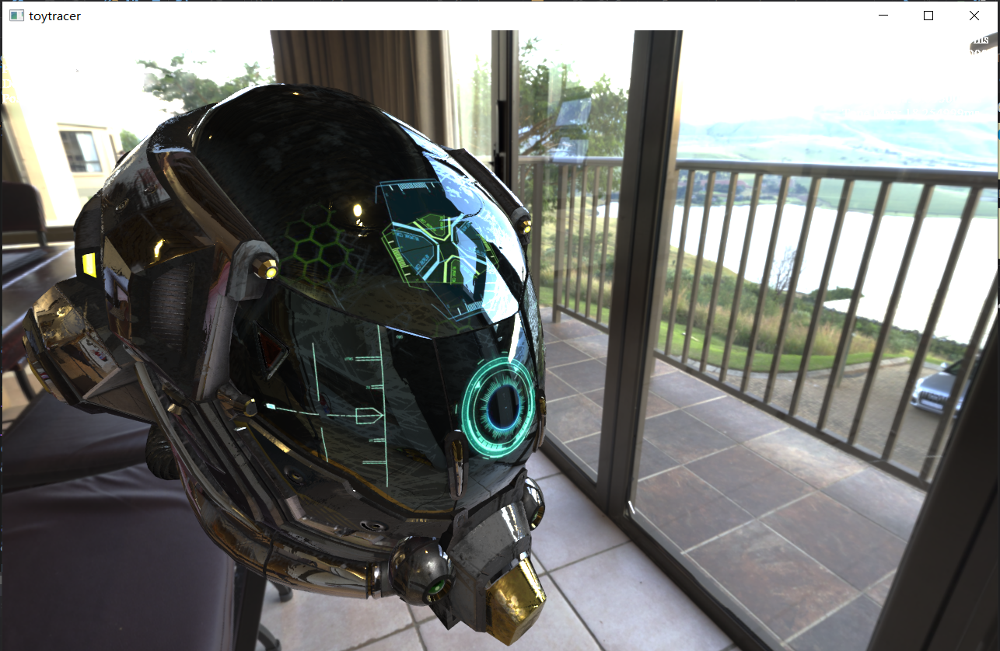
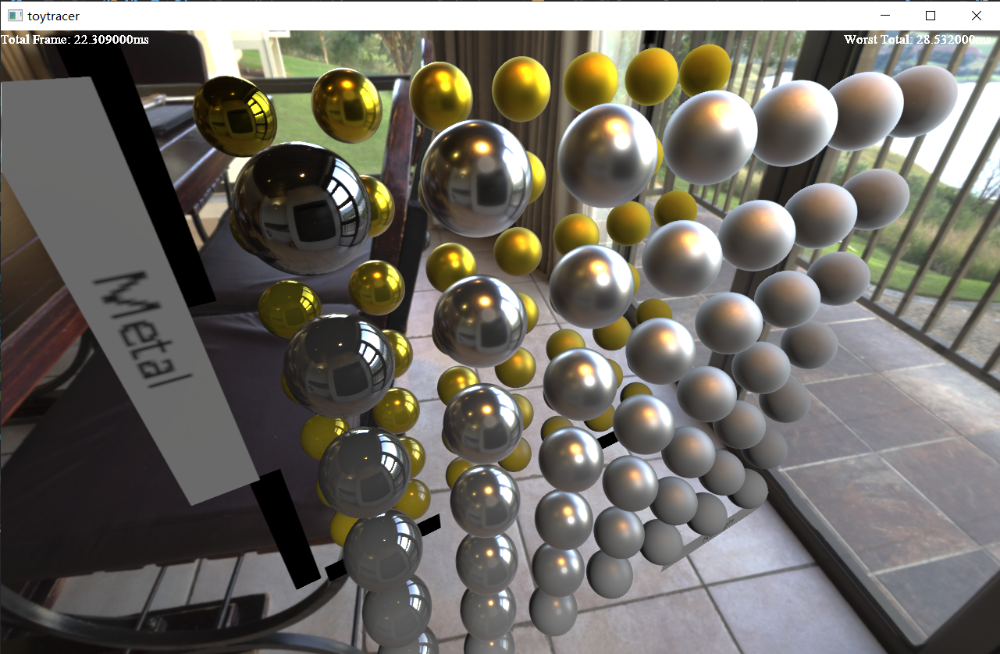
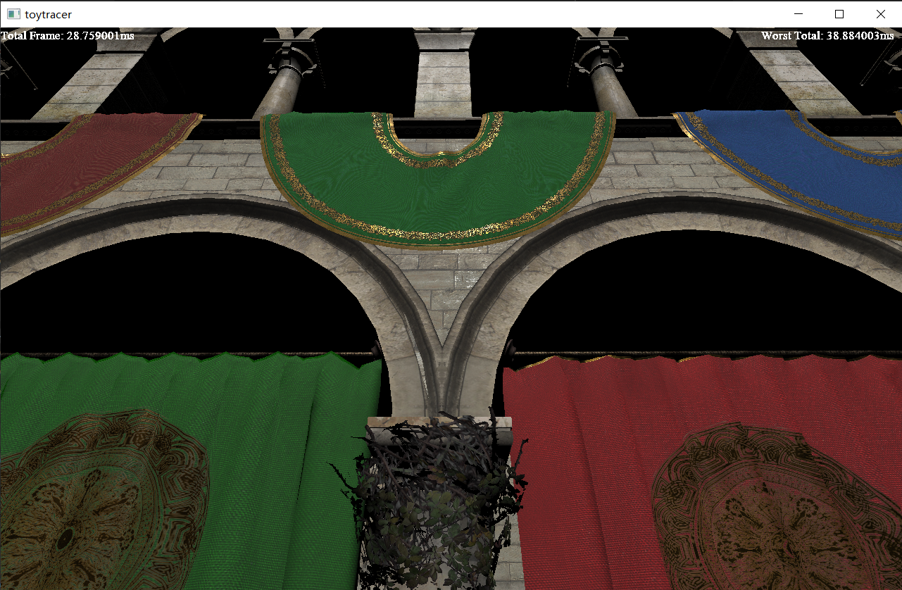
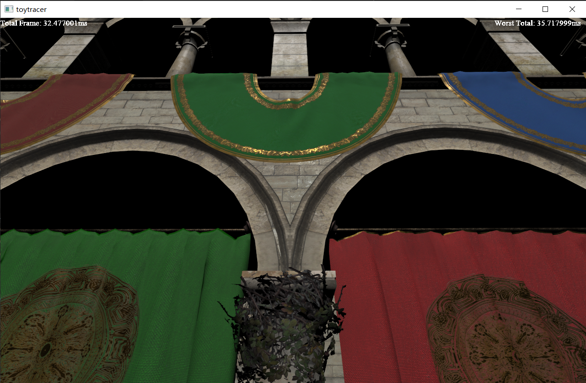
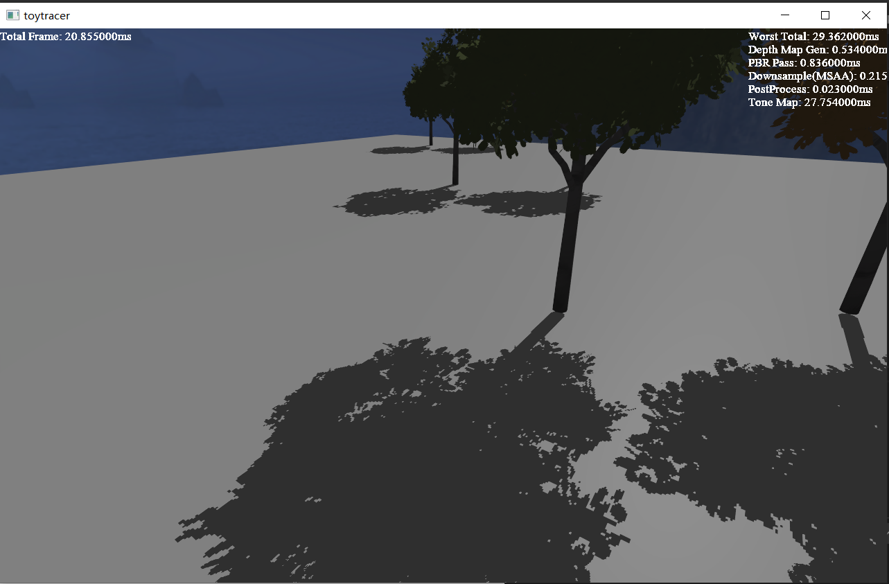
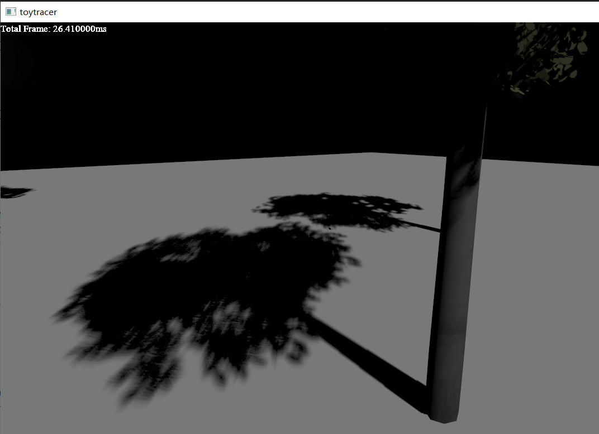

# Toy Renderer
Everyone learning CG seems to have implemented his/her own renderer from scratch. So this one is mine.

Toy Renderer is implemented using OpenGL 3.3.

# Features
- Most of glTF format support

- PBR

- Temporal Antialiasing

  See the relevant write-up on [Zhihu](https://zhuanlan.zhihu.com/p/112565771).
  - TAA Disabled
  
  - TAA enabled
  
- Cascaded Shadow Mapping

- Percentage-Closer Soft Shadow

# To-do

- [ ] Scene representation using Octree.

- Bugs
  - Store g channel of the LUT image in float, NOT int, for higher precision.
