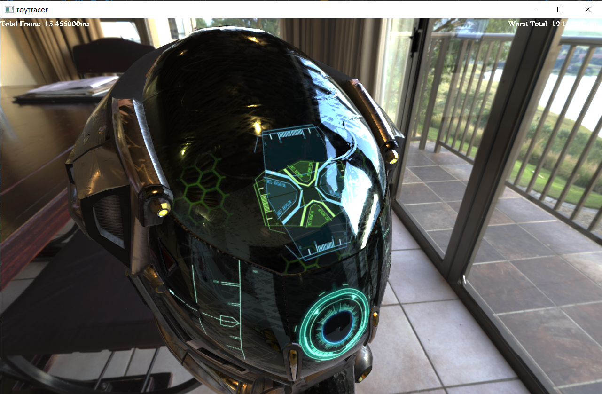

# Toy Renderer
Everyone learning CG seems to have implemented his/her own renderer from scratch. So this one is mine.

Toy Renderer is implemented using OpenGL 3.3.

# Features
- Most of glTF format support

- PBR

- Temporal Antialiasing
  - TAA Disabled
  
  - TAA enabled
  
- Cascaded Shadow Mapping

- Percentage-Closer Soft Shadow
